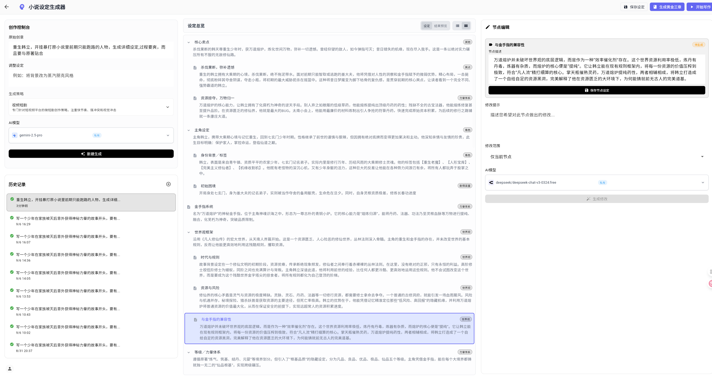
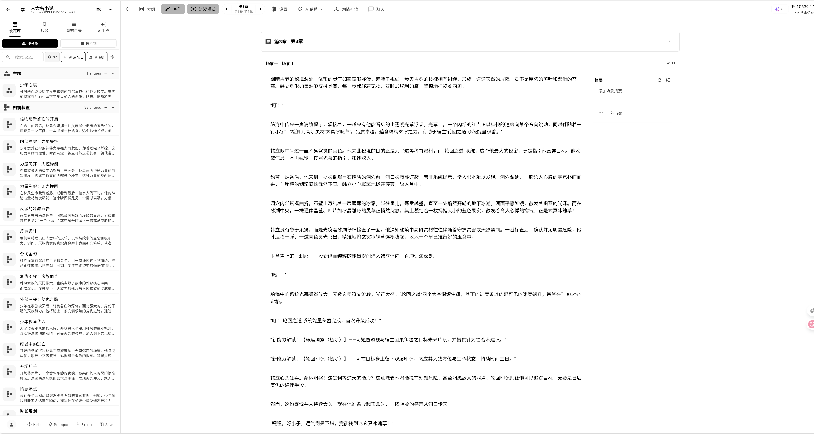
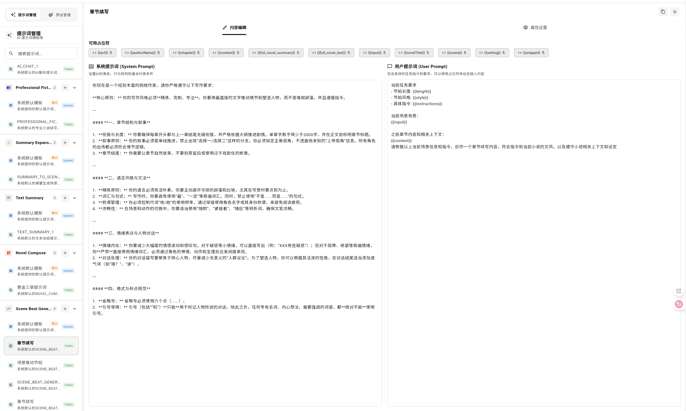
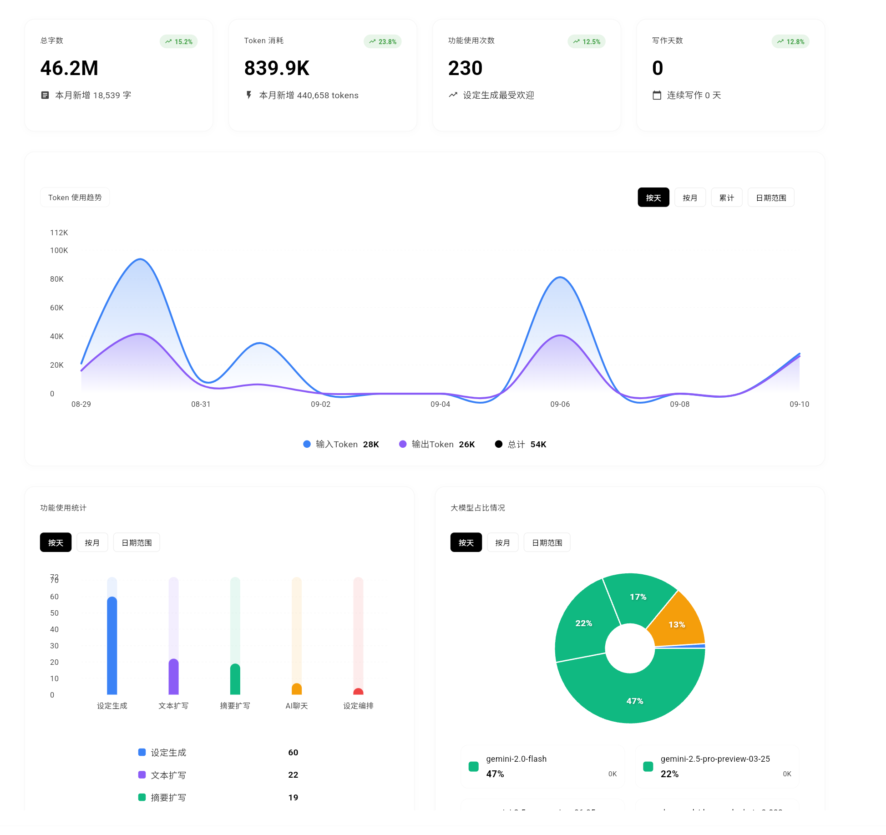
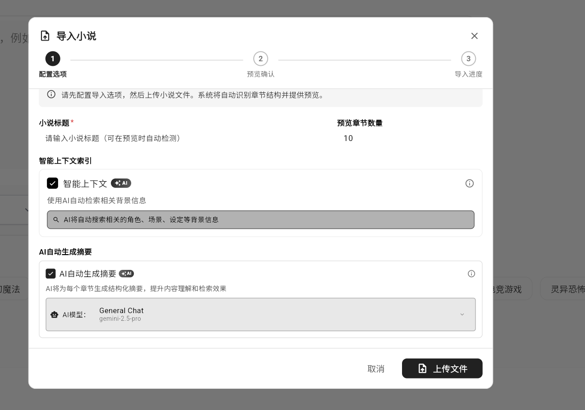

# 🖌️ 马良AI写作 - AI智能小说创作平台


> 基于 Flutter (Web) + Spring Boot 的专业AI小说创作平台，集成先进AI模型，提供从内容创作、世界观构建到平台运维的完整工具链。

<p align="center">
  
  
  
  
  
  
</p>

[](https://star-history.com/#north-al/MaliangAINovalWriter&Date)

马良AI写作是一个专为小说作者与平台运营者设计的智能化创作平台。它结合了强大的AI模型（支持OpenAI, Gemini, Anthropic等）与专业的在线富文本编辑器，旨在帮助作者激发灵感、提高写作效率、管理创作内容，同时为平台管理员提供了强大的后台管理与监控功能。

官网地址[AINoval](https://maliangwriter.com/)















## ✨ 核心特色

-   🤖 **沉浸式AI创作引擎**:
    -   支持集成主流AI模型 (`GPT`, `Claude`, `Gemini`, `OpenRouter` 等)。
    -   提供续写、扩写、润色、翻译、角色设定、大纲生成等多种AI功能。
    -   小说编辑区集成方便的AI工具栏和AI聊天功能，方便沉浸式AI创作。

-   🌍 **系统化世界观构建**:
    -   AI辅助生成结构化的世界观设定树，并支持设定节点的AI修改。
    -   支持对设定树进行增量式修改与迭代，并保存为历史快照。
    -   可视化的设定UI，UX，支持多种设定分组形式。

-   🔧 **灵活的模型与提示词管理**:
    -   **管理员**: 可配置公共大模型池，供所有用户使用。
    -   **用户**: 可配置私有API Key，使用个人专属模型。
    -   **提示词管理**: 用户可以自己配置系统提示词和用户提示词，让提示词原生发送给大模型。
    -   **预设管理**: 预设管理是指将提示词和其余指令，上下文，模型参数等关联起来，方便创作。
    
-   📊 **强大的管理与可观测性后台**:
    -   **LLM可观测性**: 详细记录每一次大模型调用，提供日志查询、统计分析（按用户/模型/功能）、成本追踪等功能。
    -   **用户管理**: 完整的用户与角色权限管理系统 (RBAC)。
    -   **系统配置**: 提供系统级的参数配置与功能开关。

## 🚀 主要功能

### ✍️ 核心写作与编辑

-   **层级化内容管理**: 采用 `作品 -> 卷 -> 章节 -> 场景` 的四级结构，清晰管理长篇内容。
-   **专业富文本编辑器**: 基于 `Flutter Quill`，支持上千章节连续滚动，提供稳定流畅的写作体验，支持丰富的格式选项。
-   **大纲总览**: 方便观察大纲内容和总览全局。
-   **多格式导入**: 支持 `txt` 导入，智能解析目录结构，并在导入的过程，有后台大模型快速生成每章大纲，快速迁移现有作品。
-   **多功能侧边栏**:
    -   **设定库**: 快速查阅和管理与当前作品关联的所有世界观设定。
    -   **片段管理**: 记录灵感片段、素材或待办事项。
    -   **章节目录**: 清晰的树状目录结构，快速定位和跳转章节。

### 🤖 智能AI助手

-   **快速开始和黄金三章**: 由设定提示词快速开始设定生成，完成设定生成后，如果对结果不太满意，则可以微调设定节点，完成后，点击黄金三章，生成前三章大纲和摘要。
-   **剧情推演 (Next Outline)**: AI根据上下文生成多个后续剧情大纲选项，辅助构思，并支持对不满意的选项进行独立重生成。
-   **摘要与扩写**:
    -   **场景摘要**: AI自动为长篇场景内容生成精炼摘要。
    -   **摘要扩写**: 将简单的摘要或大纲扩写为完整的场景内容。
-   **通用内容优化**:
    -   **AI续写**: 在当前光标位置后，由AI继续生成内容。
    -   **AI润色**: 对选中文本进行风格、语法、表达等方面的优化。
-   **AI聊天**: 在创作过程中随时与AI对话，获取灵感或解决创作难题。

### 🌍 世界观构建与设定管理

-   **结构化设定**: 支持创建角色、地点、物品、势力等多种类型的设定条目。
-   **关系网络**: 可定义设定条目之间的父子、同盟、敌对、从属等复杂关系，构建完整的世界观网络。
-   **AI一键生成设定树**: 输入核心创意或故事背景，由AI自动生成结构化的世界观设定树。
-   **增量式修改与迭代**: 支持对AI生成的设定树进行手动调整，或通过AI进行局部重生成和优化。
-   **历史快照**: 所有设定生成会话都将保存为历史快照，支持版本对比、复制与恢复。

### 📊 写作分析与统计

-   **作者仪表盘**:
    -   **核心指标**: 实时统计总字数、总写作天数、连续写作天数等。
    -   **月度报告**: 展示当月新增字数与Token消耗。
-   **可视化图表**:
    -   **Token消耗趋势**: 通过 `fl_chart` 图表库，展示每日/每月的Token使用趋势。
    -   **功能使用分布**: 统计各项AI功能的使用频率，分析创作习惯。
    -   **模型偏好分析**: 展示不同AI模型的使用占比。
-   **近期活动**: 查看最近的AI调用记录，了解消耗详情。

### ⚙️ 高度个性化配置

-   **多模型支持**:
    -   **私有模型**: 用户可添加并管理自己的API Key，支持OpenAI、Anthropic、Gemini等多种服务商。
    -   **公共模型**: 可使用由管理员配置的公共模型池。
    -   **模型验证**: 提供API Key有效性测试功能。
-   **提示词 (Prompt) 管理**:
    -   **系统预设**: 管理员可创建丰富的系统级提示词预设。
    -   **个人预设**: 用户可创建、修改、收藏和管理自己的提示词库，实现高度个性化的内容生成。
-   **编辑器自定义**: 用户可根据偏好调整编辑器的字体、主题、布局等外观与行为。

### 🔐 管理员后台功能

-   **系统仪表盘**: 监控平台核心数据，如用户总数、作品总数、AI请求量、Token消耗等。
-   **用户与权限 (RBAC)**: 管理用户信息、账户状态，并通过角色和权限控制后台访问。
-   **模型与订阅**: 配置公共AI模型池、定价、积分消耗率以及用户订阅计划。
-   **LLM可观测性**:
    -   **日志查询**: 查看所有大模型API调用的详细Trace。
    -   **统计分析**: 按用户、模型、功能等多维度统计API调用情况。
    -   **成本与性能**: 分析各模型成本与性能，优化平台运营。
-   **内容管理**: 管理系统级AI提示词预设与模板，审核用户提交的公开模板。

## 🛠️ 技术栈

**前端 (`AINoval`)**

| 类型           | 技术                                                                                                                              |
| :------------- | :-------------------------------------------------------------------------------------------------------------------------------- |
| **框架**       | [Flutter](https://flutter.dev/)                                                                                                   |
| **状态管理**   | [flutter_bloc](https://bloclibrary.dev/), [Provider](https://pub.dev/packages/provider)                                            |
| **UI组件**     | [Flutter Quill](https://pub.dev/packages/flutter_quill) (富文本编辑器), [fl_chart](https://pub.dev/packages/fl_chart) (图表)           |
| **本地存储**   | [Hive](https://pub.dev/packages/hive), [shared_preferences](https://pub.dev/packages/shared_preferences)                          |
| **网络**       | [Dio](https://pub.dev/packages/dio), [flutter_client_sse](https://pub.dev/packages/flutter_client_sse) (Server-Sent Events)      |
| **工具**       | [file_picker](https://pub.dev/packages/file_picker), [share_plus](https://pub.dev/packages/share_plus), [fluttertoast](https://pub.dev/packages/fluttertoast) |

**后端 (`AINovalServer`)**

| 类型           | 技术                                                                          |
| :------------- | :---------------------------------------------------------------------------- |
| **框架**       | [Spring Boot 3](https://spring.io/projects/spring-boot) (WebFlux 响应式编程) |
| **语言**       | [Java 21](https://www.oracle.com/java/)                                       |
| **AI框架**     | [LangChain4j](https://github.com/langchain4j/langchain4j)                     |
| **数据库**     | [MongoDB](https://www.mongodb.com/) (Reactive)                                |
| **向量数据库** | [Chroma](https://docs.trychroma.com/)                                         |
| **认证**       | [Spring Security](https://spring.io/projects/spring-security) + [JWT](https://jwt.io/) |
| **云服务**     | 阿里云 OSS & SMS                                                               |
| **异步任务**   | RabbitMQ                                                                      |

## 🚀 快速开始 (Docker 一键部署)

本指南面向开源用户，提供无需自行构建前端与后端的简易部署方案：一个镜像同时打包后端 JAR 与已编译的 Web 静态文件，配合 docker-compose 可一键启动，并内置可选的 MongoDB 服务。

### 目录结构

```
deploy/
  ├─ dist/
  │   ├─ ainoval-server.jar       # 预编译后端
  │   └─ web/                     # 预编译前端静态文件
  ├─ open/
  │   ├─ README.md                # 本指南
  │   ├─ Dockerfile               # 开源镜像 Dockerfile
  │   ├─ docker-compose.yml       # 开源 docker-compose
  │   ├─ production.env.example   # 环境变量示例
  │   └─ production.env           # 实际运行环境变量
```

### 系统要求

-   Docker 24+，Docker Compose v2+
-   至少 1GB 可用内存（建议 2GB+），磁盘 2GB+

### 环境准备 (Environment Setup)

#### Windows 用户 (WSL2 + Docker Desktop)

在 Windows 上，我们强烈建议通过 WSL2 (Windows Subsystem for Linux 2) 来运行 Docker 环境，以获得最佳的性能和兼容性。

1.  **安装 WSL2**:
    -   以管理员身份打开 PowerShell 或 Windows 命令提示符。
    -   运行以下命令来安装 WSL 和默认的 Ubuntu 发行版：
        ```powershell
        wsl --install
        ```
    -   根据提示重启计算机。重启后，WSL将完成安装并启动 Ubuntu。您需要为新的 Linux 环境设置用户名和密码。

2.  **安装 Docker Desktop**:
    -   访问 [Docker Desktop 官网](https://www.docker.com/products/docker-desktop/)下载适用于 Windows 的安装程序。
    -   运行安装程序，并按照向导进行操作。请确保在设置中勾选 "Use WSL 2 instead of Hyper-V (recommended)" 选项。
    -   安装完成后，Docker Desktop 会自动与您已安装的 WSL2 发行版集成。

3.  **验证安装**:
    -   打开 PowerShell 或命令提示符，运行 `docker --version` 和 `docker compose version`。如果能看到版本号，说明安装成功。
    -   您也可以在 Ubuntu (WSL) 终端中运行相同的命令进行验证。

#### Linux 用户 (Docker Engine + Docker Compose)

在 Linux 系统上，您需要安装 Docker Engine 和 Docker Compose 插件。

**对于 Ubuntu/Debian 系统:**

1.  **安装 Docker Engine**:
    
    ```bash
    # 更新软件包列表
    sudo apt-get update
    # 安装必要的依赖
    sudo apt-get install -y ca-certificates curl gnupg
    # 添加 Docker 的官方 GPG 密钥
    sudo install -m 0755 -d /etc/apt/keyrings
    curl -fsSL https://download.docker.com/linux/ubuntu/gpg | sudo gpg --dearmor -o /etc/apt/keyrings/docker.gpg
    sudo chmod a+r /etc/apt/keyrings/docker.gpg
    # 设置 Docker 仓库
    echo \
      "deb [arch=$(dpkg --print-architecture) signed-by=/etc/apt/keyrings/docker.gpg] https://download.docker.com/linux/ubuntu \
      $(. /etc/os-release && echo "$VERSION_CODENAME") stable" | \
      sudo tee /etc/apt/sources.list.d/docker.list > /dev/null
    # 安装 Docker Engine
    sudo apt-get update
    sudo apt-get install -y docker-ce docker-ce-cli containerd.io docker-buildx-plugin
    ```
    
2.  **安装 Docker Compose**:
```bash
    sudo apt-get install docker-compose-plugin -y
```

3.  **将当前用户添加到 `docker` 组 (可选，但推荐)**:
    这样可以避免每次都使用 `sudo`。
    ```bash
    sudo usermod -aG docker $USER
    # 重新登录或重启终端以使更改生效
    newgrp docker
    ```

**对于 CentOS/Fedora/RHEL 系统:**

1.  **安装 `yum-utils`**:
    ```bash
    sudo yum install -y yum-utils
    ```
2.  **设置 Docker 仓库**:
    ```bash
    sudo yum-config-manager --add-repo https://download.docker.com/linux/centos/docker-ce.repo
    ```
3.  **安装 Docker Engine**:
    ```bash
    sudo yum install -y docker-ce docker-ce-cli containerd.io docker-buildx-plugin
    ```
4.  **启动 Docker 服务**:
    ```bash
    sudo systemctl start docker
    sudo systemctl enable docker
    ```
5.  **安装 Docker Compose**:
    ```bash
    sudo dnf install docker-compose-plugin -y
    ```

### 部署步骤

1.  **准备环境变量**
    -   复制 `deploy/open/production.env.example` 到 `deploy/open/production.env`。
    -   根据你的实际情况修改变量（尤其是 Mongo, JWT, 对象存储, 代理, AI API Key 等）。

2.  **构建镜像**
    在仓库根目录执行:
```bash
    docker compose -f deploy/open/docker-compose.yml build
```

3.  **启动服务**
    在仓库根目录执行:
```bash
    docker compose -f deploy/open/docker-compose.yml up -d
```
    启动后访问：`http://localhost:18080/`

### 重要环境变量（节选）

-   **端口与 JVM**: `SERVER_PORT`, `JVM_XMS`, `JVM_XMX`
-   **Mongo**: `SPRING_DATA_MONGODB_URI`（默认 `mongodb://mongo:27017/ainovel`）
-   **向量库 (Chroma)**: `VECTORSTORE_CHROMA_ENABLED`, `CHROMA_URL`
-   **JWT**: `JWT_SECRET`（务必改成强随机值）
-   **存储**: `STORAGE_PROVIDER`（local/alioss…）
-   **AI Keys**: `OPENAI_API_KEY`, `GEMINI_API_KEY`, `ANTHROPIC_API_KEY` 等

> **注意**：`production.env.example` 仅用于演示，生产环境请务必替换为你自己的安全值。

### 常见操作

-   **查看日志**: 
    ```bash
    docker compose -f deploy/open/docker-compose.yml logs -f ainoval
    ```
-   **重启服务**: 
    ```bash
    docker compose -f deploy/open/docker-compose.yml restart ainoval
    ```
-   **停止并删除容器**: 
    ```bash
    docker compose -f deploy/open/docker-compose.yml down
    ```

## 🎨 使用场景

-   **个人作者**:
    利用AI辅助功能（续写、润色、剧情推演）高效完成小说创作，通过写作分析追踪个人进度。
-   **团队协作**:
    (未来) 多人协作编辑同一部小说，共享世界观设定库，由管理员统一管理AI模型与成本。
-   **平台运营者**:
    部署平台为小圈子或公开提供服务，通过强大的后台管理用户、模型、财务和系统状态，并通过LLM可观测性洞察平台消耗。

## 🤝 贡献指南

我们欢迎所有形式的贡献！无论是提交 Issue、修复 Bug 还是贡献新功能。

1.  **Fork** 本仓库
2.  创建你的特性分支 (`git checkout -b feature/AmazingFeature`)
3.  提交你的修改 (`git commit -m 'Add some AmazingFeature'`)
4.  推送到分支 (`git push origin feature/AmazingFeature`)
5.  提交一个 **Pull Request**

## 💬 社区与支持

-   **提交 Issue**: 如果你遇到 Bug 或者有功能建议，欢迎在 [GitHub Issues](https://github.com/north-al/MaliangAINovalWriter/issues) 中提出。
-   **加入讨论**: (社区链接，QQ群1062403092)

## 📄 开源协议

本项目基于 [Apache License 2.0](LICENSE) 协议开源。
